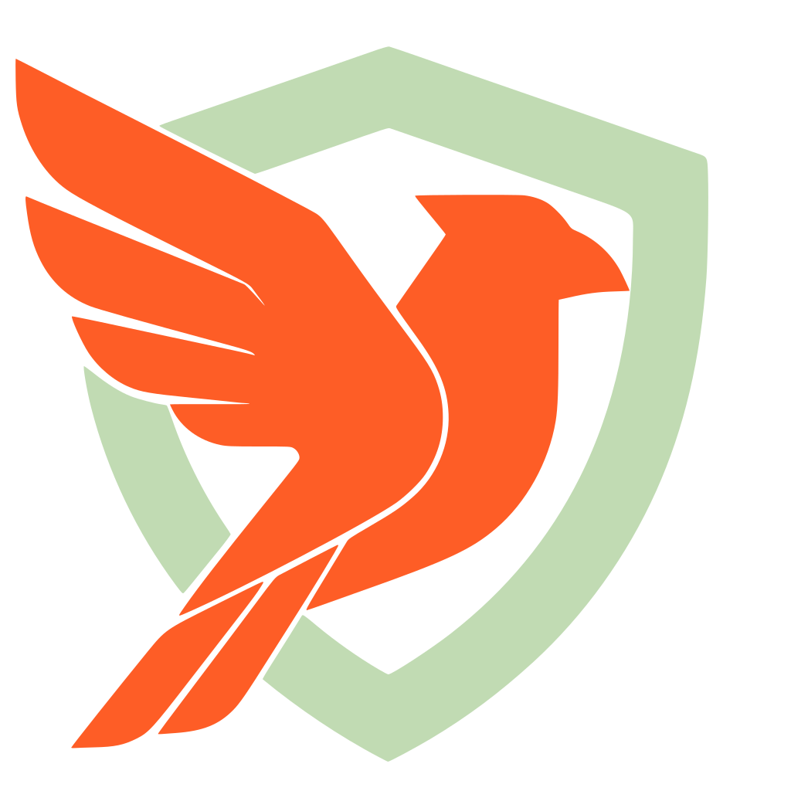
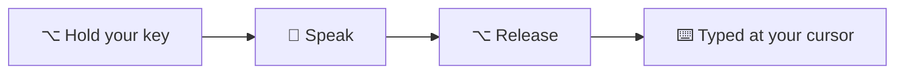
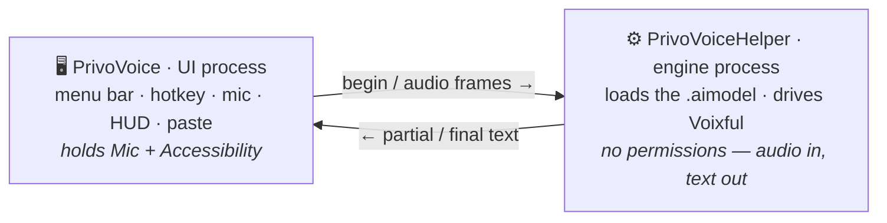

<div align="center">



# PrivoVoice

### You talk. We write.

**Hold your favorite key · speak · release** — it's typed wherever your cursor is.
…and your privacy is guaranteed: every word is transcribed on your Mac, never in the cloud.

**[🌐 Website](https://austinjiangh.github.io/PrivoVoice/)** · **[⬇️ Download](https://github.com/AustinJiangH/PrivoVoice/releases/latest)**

[](LICENSE)
[](#-quick-start)
[](#-quick-start)
[](#-why-privovoice)
[](#)
[](https://github.com/AustinJiangH/voixful)
[](#-why-privovoice)

</div>

---

PrivoVoice turns **any** text field into a microphone. Hold your favorite key,
talk while a floating HUD shows your words live, release — the transcript lands
at your cursor, in whatever app you're using: email, docs, chat, code. Everything
runs **100% on-device** on Apple Silicon through Apple's Core AI runtime, powered
by the [**Voixful**](https://github.com/AustinJiangH/voixful) speech engine.
No cloud. No account. No subscription. Not "free trial", not "free tier" — just free.



*Nothing leaves your Mac — capture, transcription, polish, and paste all happen on-device.*

## ✨ Why PrivoVoice

- 🔒 **Truly private** — audio and text are processed locally and never leave the device. No network calls, no telemetry, no analytics. Works with Wi-Fi off.
- ⌨️ **Works everywhere** — pastes into any app at the cursor; no per-app integration.
- ⚡ **Push-to-talk** — hold to talk, release to type. Your trigger key is *consumed*, so it never types while you dictate.
- 📺 **Live HUD** — a floating heads-up display shows the transcription *while* you speak.
- 🧠 **Your choice of model** — nine on-device models from a 0.6 B streaming model (lowest latency) to 2.5 B (best punctuation), covering 25+ languages. Download in-app; the Models tab organizes them by use case.
- ✍️ **Optional auto-polish** — an on-device LLM (Qwen3 1.7B, MLX 4-bit, ~1 GB opt-in download) fixes punctuation and mis-hearings, strips filler words, applies spoken self-corrections ("Monday — no wait, Tuesday" keeps only Tuesday), and formats spoken enumerations as numbered lists. Each behavior is its own toggle, all **off by default**; adds ~0.1–0.35 s per dictation once warm.
- 📊 **Dashboard** — minutes spoken, words typed, playful equivalents ("2.3× a sitcom episode"), and charts by day, hour, and model. Computed and stored locally, like everything else.
- 🚀 **Guided onboarding** — pick what you'll use it for, get a model recommendation, choose your talk key, grant permissions. Dictating in minutes.
- 🛡️ **Minimal permissions** — Microphone + Accessibility only. **No Input Monitoring, ever.**
- 🧩 **Crash-isolated** — the model runs in a separate process, so an engine hiccup can't take the app down.
- 🆓 **Free & open source** — Apache-2.0, no account, no paywall, no usage limits.

## 🧠 Models

Pick a model in the **Models** tab and it downloads on-device. All are Apple
Core AI (Palette4) conversions, published on Hugging Face; each card in the app
shows speed, accuracy, size, and language support at a glance:

| Model | Languages | Params · size | Weights | Best for |
| --- | --- | --- | --- | --- |
| [Nemotron Streaming](https://huggingface.co/AustinJiangH/voixful-nemotron-speech-streaming-en-0.6b) | English | 0.6 B · ~330 MB | NVIDIA Open Model | Lowest latency — *streams natively*, words appear while you speak |
| [Parakeet TDT v2](https://huggingface.co/AustinJiangH/voixful-parakeet-tdt-0.6b-v2) | English | 0.6 B · ~335 MB | CC-BY-4.0 | Smallest and fastest, best English accuracy of the small tier |
| [Parakeet TDT v3](https://huggingface.co/AustinJiangH/voixful-parakeet-tdt-0.6b-v3) | 25 European languages | 0.6 B · ~370 MB | CC-BY-4.0 | Multilingual, still fast |
| [Granite Speech NAR](https://huggingface.co/AustinJiangH/voixful-granite-speech-4.1-2b-nar) | en · fr · de · es · pt | 2.2 B · ~1.1 GB | Apache-2.0 | The most accurate overall |
| [Canary-Qwen](https://huggingface.co/AustinJiangH/voixful-canary-qwen-2.5b) | English | 2.5 B · ~2.4 GB | CC-BY-4.0 | Best punctuation and casing |
| [Whisper Small](https://huggingface.co/AustinJiangH/voixful-whisper-small) | English | 0.24 B · ~630 MB | MIT | Compact Whisper at a modest footprint |
| [Whisper Medium](https://huggingface.co/AustinJiangH/voixful-whisper-medium) | English | 0.77 B · ~1.9 GB | MIT | Better English accuracy than Small |
| [Whisper Large v3 Turbo](https://huggingface.co/AustinJiangH/voixful-whisper-large-v3-turbo) | English | 0.81 B · ~970 MB | MIT | Near-large accuracy with a lighter, faster decoder |
| [Whisper Large v3](https://huggingface.co/AustinJiangH/voixful-whisper-large-v3) | English | 1.55 B · ~3.8 GB | MIT | Best Whisper English accuracy |

> Only Nemotron streams natively; the others re-transcribe the growing utterance
> for live partials. Whisper models have a hard 30 s single-pass window — longer
> dictations are segmented automatically on silence.

## 🚀 Quick start

> PrivoVoice is built on the [Voixful](https://github.com/AustinJiangH/voixful) speech
> engine, fetched automatically as a pinned SwiftPM dependency — no extra setup.
> (Hacking on the engine itself? `swift package edit Voixful --path ../voixful`
> points the build at a local checkout.)

```bash
git clone https://github.com/AustinJiangH/PrivoVoice.git
cd PrivoVoice
```

Run it:

```bash
swift run PrivoVoice          # dev run (menu-bar app)
```

Or build a real, double-clickable `.app`:

```bash
./scripts/setup-signing.sh    # once — stable signing so permissions persist
./scripts/make-app.sh         # → build/PrivoVoice.app
open build/PrivoVoice.app
```

Then follow the onboarding: pick a use case, download the recommended model,
grant the two permissions below, and **hold `fn`** (or your favorite key) to dictate.

## 🔒 Permissions

1. **Microphone** — to hear you.
2. **Accessibility** — for the push-to-talk hotkey and to paste the transcript.

<details>
<summary><b>Why no Input Monitoring?</b></summary>

The hotkey is a **consuming `CGEventTap`** (`kCGEventTapOptionDefault`) — the same
approach [Handy](https://github.com/cjpais/Handy) and OpenSuperWhisper use. A
*consuming* tap requires **Accessibility**, not Input Monitoring (only a passive
`.listenOnly` tap needs Input Monitoring). Since Accessibility is already needed
to paste, the hotkey costs no extra permission — and because the tap *consumes*
the trigger, any key/chord works (including `fn`, `fn`+Space, bare keys) without
typing while you dictate. Default is **hold `fn`**.
</details>

<details>
<summary><b>Stable signing (so grants persist across rebuilds)</b></summary>

`make-app.sh` signs with the self-signed **PrivoVoice Dev** identity created by
`setup-signing.sh` (needs Homebrew `openssl@3`; the first `codesign` shows one
keychain prompt — click **Always Allow**). Ad-hoc signing changes identity every
build, so macOS would forget your grants — that's what the stable identity fixes.
Local dev only; use a Developer ID + notarization to distribute.
</details>

## 🏗️ Architecture

Two processes, so a crash or hang in the (beta) Core AI runtime can't take the UI
down — the native equivalent of how Handy isolates its Rust core:



<details>
<summary><b>Targets & the reusable core</b></summary>

The app splits into portable and macOS-only pieces so the non-UI logic could power a future iOS app too:

- **`PrivoVoiceKit`** *(portable)* — model catalog, download/store, settings, `AudioCapture`, `DictationController`, the `DictationEngine` protocol + in-process engine, usage telemetry (all local), and the optional transcript formatter (`Formatting/`: MLX LLM with prefix-KV caching). No AppKit/SwiftUI.
- **`PrivoVoiceIPC`** *(portable)* — the tiny stdio wire protocol shared by both processes.
- **`PrivoVoiceApp`** *(macOS)* — SwiftUI UI (Dashboard + Models + Settings), onboarding, HUD, menu bar, hotkey, paste, and the sidecar-spawning engine.
- **`PrivoVoiceHelper`** *(macOS)* — the resident engine process (the sidecar); also hosts the resident formatter LLM when transcript polish is on.

The split hides behind the `DictationEngine` protocol: macOS injects the sidecar;
a future iOS app reuses `PrivoVoiceKit` with the in-process engine instead — no
other change.
</details>

## 🌐 Website

**[austinjiangh.github.io/PrivoVoice](https://austinjiangh.github.io/PrivoVoice/)** —
the marketing site lives in this repo at [`docs/`](docs/), a single static page
(plus [`llms.txt`](docs/llms.txt) for AI crawlers) served via GitHub Pages.

## 🌱 Built on Voixful

PrivoVoice is the app; **[Voixful](https://github.com/AustinJiangH/voixful) is the
engine.** Voixful is an open-source, `SpeechAnalyzer`-shaped API over local speech
models on Apple Silicon (Core AI) — it handles mel extraction, model loading, and
transcription across every backend (Nemotron, Parakeet, Granite, Canary, Whisper, …).
PrivoVoice adds the product on top: the push-to-talk UX, model management, the
floating HUD, auto-polish, the dashboard, and the two-process sandboxing.

> Want to build your own on-device speech app? Start with **[Voixful](https://github.com/AustinJiangH/voixful)**.
> Just want to dictate? That's **PrivoVoice**. 💚

## 📄 License

PrivoVoice © 2026 Austin Jiang, **Apache-2.0** (see [`LICENSE`](LICENSE)) — code,
website, the lot. Built on [Voixful](https://github.com/AustinJiangH/voixful)
(also Apache-2.0).

Model **weights** are downloaded separately and carry their own upstream licenses
(CC-BY-4.0 · Apache-2.0 · MIT · NVIDIA Open Model License) — see each model card
on Hugging Face. Keep the weights' licenses separate from this Apache-2.0 code
when you redistribute.
